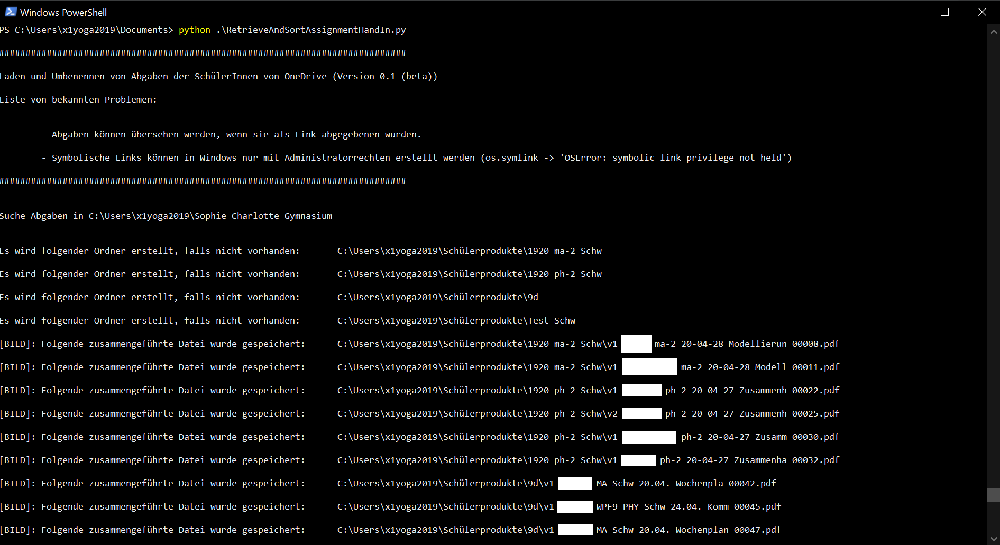

# Microsoft Teams Retrieve Assignments Hand In

## First steps

Download the OneDrive App  and make sure you are logged in with your organizations OneDrive Account.

Navigate to the sharepoint folder  of your organization and your class (which should be a closed team).

Navigate to "Websiteinhalte" and select "Aufgaben der Schüler". 

Select "Synchronisieren" on top. The OneDrive App will automatically retrieve the folder and its subdirectories.

At this point you have the folder structure replicated on your computer.

This is where we can start using this script.

## Usage of the script

